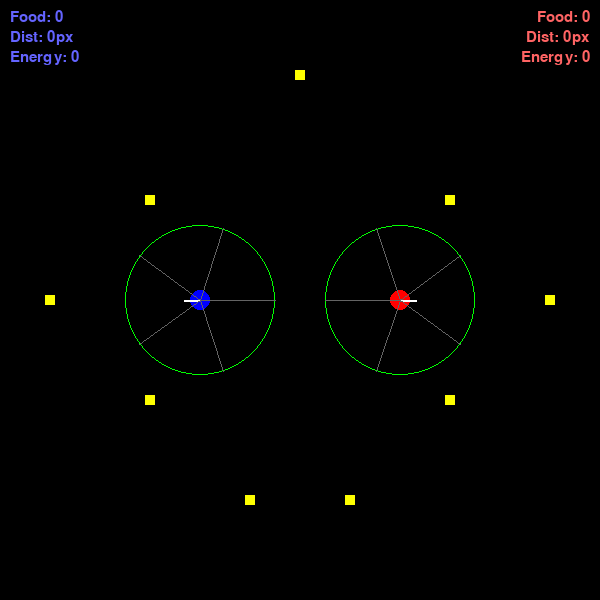

<div align="center">
    <h1>Co-evolution of Robots</h1>
    <h3>Author: Christian Faccio</h3>
    <h5>Emails: christianfaccio@outlook.it</h4>
    <h5>Github: <a href="https://github.com/christianfaccio" target="_blank">christianfaccio</a></h5>
    <h6></h6>
</div>

---

<div align="center">
   
</div>

---

## How to run the game

First of all, create a virtual environment and install all the requirements:
```
uv venv venv --python 3.11
source venv/bin/activate
uv pip install -r requirements.txt
```

Then, enter the `game` folder and run the `run.py` code:
```
cd game 
uv run play.py --genome <select a checkpoint> --opponent <random/select a checkpoint>
```
